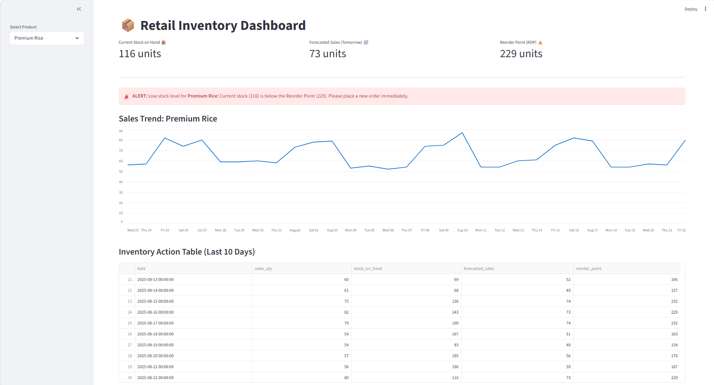
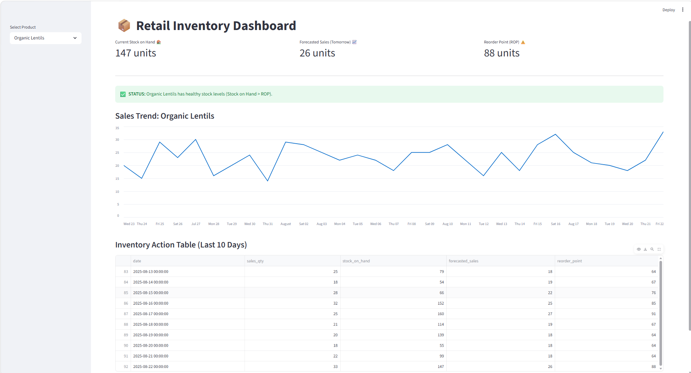
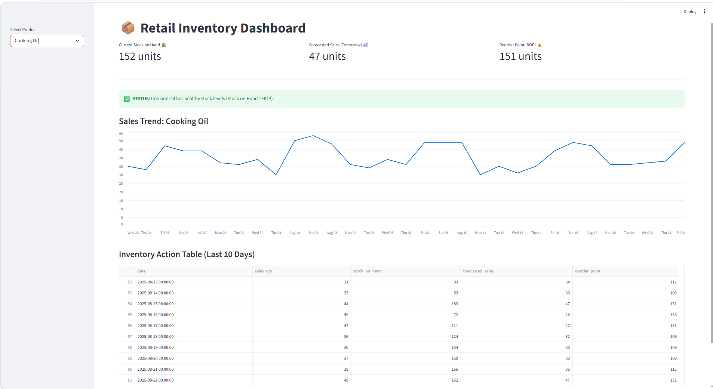

# 📦 Retail Sales Forecasting & Inventory Optimization System

[](https://www.python.org/)
[](https://streamlit.io/)
[](https://xgboost.readthedocs.io/)

An AI-powered end-to-end solution for modern retail businesses to predict demand and automate stock replenishment. This project bridges the gap between **Data Science** and **Supply Chain Operations**.

---

## 🚀 Project Overview
Retailers often struggle with two main problems: **Stockouts** (lost sales) and **Overstocking** (wasted capital). This system provides a data-driven solution by:
1. **Predicting Demand:** Utilizing **XGBoost** to forecast daily sales trends.
2. **Optimizing Inventory:** Calculating the exact **Reorder Point (ROP)** and **Safety Stock** needed to maintain a **95% service level**.

---

## 📊 Project Visuals

### AI-Powered Inventory Dashboard


### 📈 Sales Trends


### 📉 Product-Specific Insights (Cooking Oil)


---

## 🛠️ Tech Stack
- **Language:** Python 3.11+
- **Machine Learning:** XGBoost Regressor
- **Data Engineering:** Pandas, NumPy
- **Mathematics:** Scipy (Normal Distribution for Safety Stock)
- **Visualization:** Matplotlib, Seaborn, Streamlit (Interactive UI)
- **Persistence:** Joblib

## 📂 Project Structure
```text
Retail-Inventory-Optimizer/
├── app/
│   └── main.py                 # Streamlit Dashboard UI
├── assets/
│   └── dashboard.png           # Dashboard Previews
├── data/
│   └── retail_sales_history.csv # 600-day Sales History
├── models/
│   └── retail_model.pkl        # Trained ML Model
├── outputs/
│   └── inventory_recommendations.csv # AI-Generated Actions
├── src/
│   ├── data_gen.py             # Synthetic Data Engine
│   └── model.py                # Feature Engineering & Training
├── requirements.txt            # Project Dependencies
└── README.md                   # Documentation
⚙️ How to Run
Follow these steps to set up the project on your local machine:

1. Environment Setup
Create a virtual environment and activate it:

PowerShell
# Create virtual environment
python -m venv venv

# Activate environment (Windows)
# If you get an execution policy error, run: Set-ExecutionPolicy -ExecutionPolicy RemoteSigned -Scope Process
.\venv\Scripts\Activate.ps1
2. Install Dependencies
Install all required libraries using pip:

PowerShell
python -m pip install --upgrade pip
pip install pandas numpy xgboost streamlit matplotlib seaborn scipy joblib
3. Generate Data and Train Model
Before running the dashboard, you must generate the dataset and train the AI model:

PowerShell
# Step A: Generate realistic sales history data
python src/data_gen.py

# Step B: Train the AI and generate inventory optimization logic
python src/model.py
4. Launch the Dashboard
Run the Streamlit application to view the interactive dashboard:

PowerShell
streamlit run app/main.py
The app will be available at http://localhost:8501 in your browser.

🧠 Core Methodology
Feature Engineering
Our model captures retail dynamics through:

Lag Features (1, 7 days): Captures daily and weekly seasonality.

Rolling Averages: Identifies short-term sales momentum.

Temporal Analysis: Incorporates weekend spikes and monthly trends.

Inventory Logic (The Mathematics)
We implement the Stochastic Inventory Model to balance risk and cost:

ROP=(Avg. Daily Sales×Lead Time)+Safety Stock
Where Safety Stock is defined as:

Safety Stock=Z×σ 
forecast
​
 × 
Lead Time

​
 
(Here, Z=1.645 for a 95% service level)

📈 Business Impact
Stockout Prevention: Automates reordering logic.

Improved Fill Rate: Maintains a 95% service level.

Waste Reduction: Minimizes overstocking.